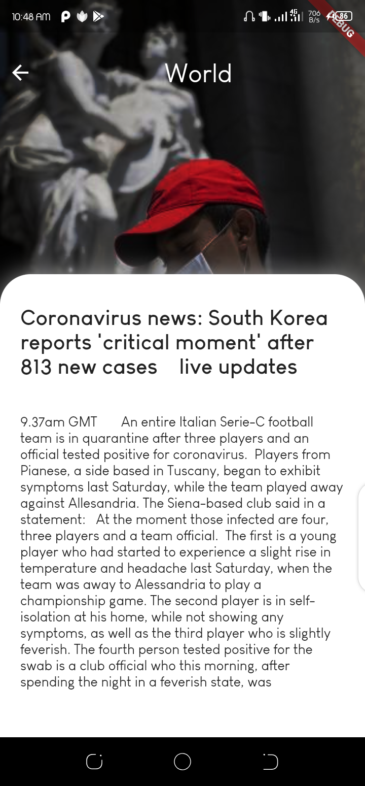

A simple News Reader (Still Buggy) made with Flutter.
 
 
download apk: 

 
<a href=""></img></a>
 

## 💻 Requirements
* Any Operating System (ie. MacOS X, Linux, Windows)
* Any IDE with Flutter SDK installed (ie. IntelliJ, Android Studio, VSCode etc)
* A little knowledge of Dart and Flutter

## ✨ Features
- [x] View News.
- [x] Read News.

## 📸 ScreenShots

|||

## 🤓 Author(s)
**Okocha Ebube**

## 🔖 LICENCE
[Apache-2.0] 